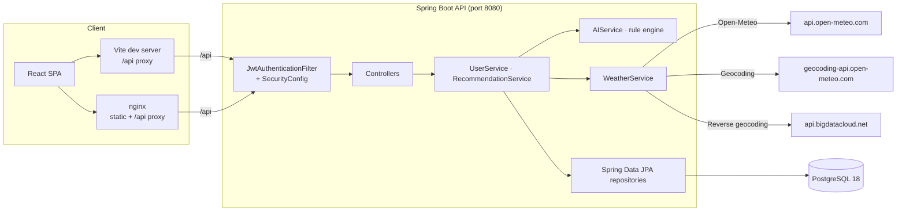

<div align="center">

# GRWM · Get Ready With Me

**Personalized outfit recommendations driven by live weather and your style.**

GRWM is a full-stack web application that tells you what to wear today. It geocodes a city or GPS position, pulls real-time weather data, runs a deterministic styling engine over the conditions and your preferred style, and returns concrete outfit suggestions that are persisted for later reference.

</div>

      

---

## Table of Contents

- [Overview](#overview)
- [Features](#features)
- [Tech Stack](#tech-stack)
- [Architecture](#architecture)
- [How It Works](#how-it-works)
- [Getting Started](#getting-started)
- [Configuration](#configuration)
- [API Documentation](#api-documentation)
- [Project Structure](#project-structure)
- [Testing](#testing)
- [Performance & Metrics](#performance--metrics)
- [Technical Decisions](#technical-decisions)
- [Security & Error Handling](#security--error-handling)
- [Future Improvements](#future-improvements)
- [What I Learned](#what-i-learned)
- [License](#license)

---

## Overview

Checking the forecast and then mentally translating it into a wardrobe is a small daily chore. GRWM removes that step: you provide a city or your current location, optionally pick a style (casual, formal, sporty, minimalist, boho), and the application returns a list of concrete items to wear, along with a one-line summary of the conditions.

**Main workflow**

1. Register with just a username, email and password — location and style are intentionally *not* required at sign-up, because they change.
2. On the dashboard, enter a city or tap **Use my location**, optionally choose a style, and request a recommendation.
3. The backend resolves the location, fetches live weather, runs the styling rule engine, persists the recommendation, and shows it with your history.

**Why this is an interesting backend project**

- Stateless JWT auth (access + refresh) with BCrypt hashing and a frontend that auto-refreshes expired tokens.
- Integration with two keyless third-party APIs (Open-Meteo, BigDataCloud) via Spring `RestClient`, with graceful degradation when they fail.
- A clean layered Spring architecture, centralized exception handling with a consistent error envelope, Jakarta Bean Validation, and an integration test suite that runs against the full HTTP surface with the weather service mocked.

## Features

**User-facing**

| Feature | Details |
|---------|---------|
| City or GPS input | Geocode a city name, or use your browser location; GPS coordinates are reverse-geocoded so history shows a readable city name |
| Live weather context | Temperature, feels-like, humidity, wind and WMO condition code for the resolved coordinates |
| Style engine | 6 temperature bands × precipitation/wind/humidity modifiers × 5 style profiles (`casual` is the base) |
| Recommendation history | Every suggestion is saved to the user's profile and listed newest-first on the dashboard |
| Saved preferences | Default city and style can be set/updated anytime via `PUT /api/users/profile` |
| Light animated UI | React 19 SPA with glass cards, ambient background motion and per-item entrance animations — no UI framework, hand-rolled CSS |

**Backend/technical**

| Feature | Details |
|---------|---------|
| JWT security | `JwtAuthenticationFilter` (a `OncePerRequestFilter`) validates `Authorization: Bearer` tokens before Spring Security's authentication filter |
| Token refresh | 401 responses trigger an automatic `/auth/refresh` call and a single retry of the original request in the frontend client |
| Ownership checks | Recommendations are scoped to the authenticated user; other users' recommendation IDs return `404` (no existence leak); deleting another account returns `403` |
| Consistent errors | A single `ApiError` JSON envelope via `GlobalExceptionHandler` maps validation, security, persistence and upstream-external failures to proper status codes |
| Environment-driven config | Every setting (DB, JWT, CORS, ports) is a `GRWM_*`/`PORT`/`VITE_*` environment variable with sane defaults |
| Containerized | Multi-stage Dockerfiles for backend and frontend, plus a 3-service Compose stack with health checks |

## Tech Stack

| Category | Technology |
|----------|-----------|
| **Backend** | Java 25, Spring Boot 4.0.2, Spring MVC, Spring Data JPA (Hibernate 7, HikariCP), Spring Security 7 (BCrypt, JWT), Spring Validation (Jakarta Bean Validation), JJWT 0.12.6, Lombok, Jackson 3 (Tools Jackson), Maven |
| **Frontend** | React 19, React Router 6, Vite 6, `@vitejs/plugin-react` — no UI component library, hand-written global stylesheets (`global.css`, `glass.css`) |
| **Database** | PostgreSQL (Docker Compose image is 18; default profile is JDBC + env-configurable), H2 in-memory (demo `h2` profile and tests) |
| **Infrastructure / DevOps** | Docker Compose 3-service stack, multi-stage Dockerfiles, nginx (SPA serving + reverse proxy), named volume for Postgres, container health checks |
| **External APIs** | Open-Meteo forecast + geocoding, BigDataCloud reverse geocoding — all keyless, called through Spring `RestClient` |

## Architecture



**Components and how they talk**

- **Frontend** (`grwm-frontend/`) — a single-page React app. A thin `api/client.js` wrapper adds the `Authorization: Bearer` header, triggers token refresh on `401` and retries once. `AuthContext` owns session state (user + localStorage tokens).
- **Dev networking** — Vite proxies `/api/*` to `http://localhost:8080`. In production Docker, nginx serves the built SPA and proxies `/api/*` to the `backend` container over the Compose network.
- **Backend** — Stateless REST API. `SecurityConfig` permits `/api/auth/**`, `/api/locations/**`, `/h2-console/**` and `/error`; everything else requires a valid JWT.
- **Persistence** — JPA entities `User` and `StyleRecommendation` with a lazy `@OneToMany` + `@OrderBy("createdAt DESC")`. `open-in-view: false` — entities are mapped to DTO records inside `@Transactional` service methods.
- **External services** — `WeatherService` owns three `RestClient`s; `AppConfig` defines them as beans with base URLs.

## How It Works

When you fire `POST /api/recommendations/suggest`, `RecommendationService` runs a strict pipeline inside a single transaction:

```text
resolve location → fetch weather → generate advice → persist → return
```

1. **Resolve location payload** — `RecommendationRequest` enforces (via a custom `@AssertTrue`) that the body provides *either* a `city` *or* both `latitude`/`longitude`.
2. **Locate** — a city is geocoded through Open-Meteo's geocoding API (first result). Coordinates are reverse-geocoded to a readable city name via BigDataCloud (`localityLanguage=en`, falling back to `locality`, returning `null` on failure so the request still succeeds).
3. **Fetch weather** — the Open-Meteo forecast endpoint returns current `temperature_2m`, `apparent_temperature`, `relative_humidity_2m`, `weather_code`, and `wind_speed_10m`. WMO codes are mapped to human-readable labels.
4. **Generate advice** — `AIService.recommend()` applies a temperature band (6 tiers from *below 0 °C* to *28 °C+*), then condition extras (precipitation → rain jacket + umbrella, snow/frozen → thermal layers, fog/cloud → mid-layer), then wind ≥ 25 km/h → windbreaker, humidity ≥ 75 % with temp > 18 °C → moisture-wicking fabrics, and finally the style profile (formal / sporty / boho / minimalist). Results are deduplicated in insertion order and capped at 8 items.
5. **Persist** — a `StyleRecommendation` row (weather snapshot + summary + item list) is attached to the current user and saved. `GET /recommendations/history` and `GET /recommendations/{id}` read it back newest-first.

Because the engine is deterministic, all external "AI" behavior is rule-based and testable — there is no ML model or hidden prompt.

## Getting Started

### Prerequisites

| Tool | Version | Needed for |
|------|---------|------------|
| [Docker](https://www.docker.com/) + Compose | Compose v2 | Quick start (Option A) |
| [Java](https://adoptium.net/) | 25 | Backend build/run (Options B/C) |
| [Node.js](https://nodejs.org/) | 20+ | Frontend dev server (Option C) |
| Maven Wrapper | bundled `./mvnw` | No global Maven required |

### Option A — Docker Compose (recommended)

```bash
git clone git@github.com:wthxrsh/GRWM.git
cd GRWM
docker compose up -d --build
```

| Service | Address | Notes |
|---------|---------|-------|
| `db` | `localhost:5434` | PostgreSQL 18, database `grwm_db`, user/password `grwm`/`grwm` |
| `backend` | `http://localhost:8080` | Spring Boot API |
| `frontend` | `http://localhost:5173` | nginx-served React build; `/api` proxied to backend |

Open **http://localhost:5173**, create an account (no city/style needed), and request an outfit.

- Postgres data persists in the named volume `grwm-db-data`.
- Tear down: `docker compose down` · also delete the data: `docker compose down -v`.
- Host ports are configurable — see the Compose-only variables below.

### Option B — Backend only (H2 in-memory)

Fastest way to exercise the API without Docker or Postgres:

```bash
./mvnw spring-boot:run -Dspring-boot.run.profiles=h2
```

The API listens on `http://localhost:8080` against an in-memory H2 database (`ddl-auto: create-drop`, H2 console at `/h2-console`). Data resets on restart. Use `curl` or a REST client.

### Option C — Local development

```bash
# Terminal 1 — backend against your own PostgreSQL
export GRWM_DB_USERNAME=postgres
export GRWM_DB_PASSWORD=your_password
./mvnw spring-boot:run

# Terminal 2 — frontend with hot reload
cd grwm-frontend
npm install
npm run dev
```

The Vite dev server runs on `http://localhost:5173` and proxies `/api/` to the backend. (No PostgreSQL? Use the `h2` profile from Option B.)

### Smoke test

```bash
# Register (returns accessToken)
curl -s -X POST http://localhost:8080/api/auth/register \
  -H 'Content-Type: application/json' \
  -d '{"username":"demo","email":"demo@example.com","password":"password123"}'

# Suggest — swap in the accessToken from the response above
curl -s -X POST http://localhost:8080/api/recommendations/suggest \
  -H 'Authorization: Bearer <accessToken>' \
  -H 'Content-Type: application/json' \
  -d '{"city":"Tokyo","stylePreference":"minimalist"}'
```

> **Note:** no hosted demo or screenshots are available yet — everything below is verified against a local run of this repository.

## Configuration

All settings are environment-driven; nothing requires editing source code.

### Backend

| Variable | Default | Description |
|----------|---------|-------------|
| `GRWM_DB_HOST` | `localhost` | PostgreSQL host |
| `GRWM_DB_PORT` | `5432` | PostgreSQL port |
| `GRWM_DB_NAME` | `grwm_db` | Database name |
| `GRWM_DB_USERNAME` | `postgres` | Database user |
| `GRWM_DB_PASSWORD` | `postgres` | Database password |
| `GRWM_JWT_SECRET` | dev secret (base64) | HMAC signing key — override in any non-local environment |
| `GRWM_JWT_ACCESS_EXPIRATION` | `900000` | Access token TTL (ms, 15 min) |
| `GRWM_JWT_REFRESH_EXPIRATION` | `604800000` | Refresh token TTL (ms, 7 days) |
| `GRWM_CORS_ORIGINS` | `http://localhost:5173,http://localhost:3000,http://127.0.0.1:5173` | Comma-separated allowed origins |
| `PORT` | `8080` | Backend HTTP port |

### Frontend

| Variable | Default | Description |
|----------|---------|-------------|
| `VITE_API_BASE` | `/api` | API base path (relative in Docker/Vite setups, absolute in standalone deploys) |

### Docker Compose only

| Variable | Default | Description |
|----------|---------|-------------|
| `GRWM_DB_HOST_PORT` | `5434` | Host port → Postgres `5432` |
| `GRWM_PORT` | `8080` | Host port → backend `8080` |
| `GRWM_FRONTEND_PORT` | `5173` | Host port → nginx `80` |

Example `.env` for Compose:

```env
GRWM_DB_HOST_PORT=5434
GRWM_PORT=8080
GRWM_FRONTEND_PORT=5173
GRWM_JWT_SECRET=replace-with-openssl-rand-base64-64
```

## API Documentation

Base URL: `http://localhost:8080/api`. Protected endpoints expect `Authorization: Bearer <accessToken>`. Request/response bodies are JSON.

There is no generated Swagger/OpenAPI spec in this repository — the API is documented below and in the test suite.

### Endpoints

| Method | Path | Auth | Description |
|--------|------|------|-------------|
| `POST` | `/auth/register` | public | Create account; returns tokens + profile |
| `POST` | `/auth/login` | public | Log in; returns tokens + profile |
| `POST` | `/auth/refresh` | public | Exchange a refresh token for new tokens + profile |
| `GET` | `/locations/reverse?latitude=&longitude=` | public | Reverse-geocode coordinates to a city name |
| `GET` | `/users/profile` | Bearer | Current user's profile |
| `PUT` | `/users/profile` | Bearer | Update `firstName`, `lastName`, `city`, `stylePreference`, `password` (partial) |
| `DELETE` | `/users/{id}` | Bearer | Delete own account (403 for another user's id) |
| `POST` | `/recommendations/suggest` | Bearer | Get an outfit recommendation |
| `GET` | `/recommendations/history` | Bearer | Own history, newest first |
| `GET` | `/recommendations/{id}` | Bearer | Single recommendation (404 if not yours) |

The HTTP prefix `/api` is stripped here; via the frontend all calls go to `/api/...`.

### `POST /auth/register`

```json
{
  "username": "alice",
  "email": "alice@example.com",
  "password": "password123",
  "firstName": "Alice",
  "lastName": "Example",
  "city": "Mumbai",
  "stylePreference": "casual"
}
```

Only `username` (3–50 chars), `email` (valid format) and `password` (≥ 8 chars) are required. Returns **201**:

```json
{
  "accessToken": "eyJhbGciOiJIUzI1NiJ9…",
  "refreshToken": "eyJhbGciOiJIUzI1NiJ9…",
  "tokenType": "Bearer",
  "expiresIn": 900000,
  "user": {
    "id": 1,
    "username": "alice",
    "email": "alice@example.com",
    "firstName": "Alice",
    "lastName": "Example",
    "city": "Mumbai",
    "stylePreference": "casual",
    "createdAt": "2026-09-07T09:30:00"
  }
}
```

### `POST /auth/login` / `POST /auth/refresh`

`/auth/login` takes `{ "username", "password" }` → **200** with the same shape as registration. `/auth/refresh` takes `{ "refreshToken" }` → **200** with a fresh pair. Bad credentials → **401**.

### `POST /recommendations/suggest`

Provide a city **or** coordinates (lat ∈ [−90, 90], lon ∈ [−180, 180]) plus an optional style:

```json
{ "city": "Tokyo", "stylePreference": "minimalist" }
```

```json
{ "latitude": 19.0760, "longitude": 72.8777 }
```

Returns **200**:

```json
{
  "id": 42,
  "city": "Tokyo",
  "latitude": 35.6762,
  "longitude": 139.6503,
  "temperature": 23.7,
  "feelsLike": 24.1,
  "humidity": 61.0,
  "windSpeed": 11.2,
  "weatherCode": 53,
  "weatherCondition": "Drizzle",
  "stylePreference": "minimalist",
  "summary": "It's about 24°C (feels like 24°C) with drizzle. This outfit keeps you comfortable in the current conditions.",
  "recommendations": ["Breathable t-shirt or blouse", "Waterproof rain jacket", "…"],
  "createdAt": "2026-09-07T09:35:00"
}
```

A city that can't be geocoded → **404**; an unreachable weather provider → **502**; both reject with the standard error envelope.

### `PUT /users/profile`

```json
{ "city": "Kyoto", "stylePreference": "minimalist", "password": "newpassword" }
```

All fields optional — only provided fields are updated; password (if present, non-blank) is re-hashed. Returns the updated profile.

### Error envelope

All failures share one shape (`GlobalExceptionHandler`):

```json
{
  "status": 400,
  "error": "Validation Failed",
  "message": "One or more fields are invalid",
  "timestamp": "2026-09-07T09:30:00",
  "fieldErrors": { "username": "Username must be between 3 and 50 characters" }
}
```

`fieldErrors` is only present for `400` validation responses. The unauthenticated entry point returns a compact `{"error":"Unauthorized","message":"Authentication required or token invalid"}` with **401**.

| Status | Meaning |
|--------|---------|
| `400` | Validation or invalid coordinate range |
| `401` | Missing/invalid token, wrong credentials |
| `403` | Deleting a different user's account |
| `404` | Unknown user/recommendation, or city not geocoded |
| `409` | Username or email already registered |
| `502` | Upstream weather/geocoding failure |
| `500` | Unexpected error (details only in server logs) |

## Project Structure

```
GRWM/
├── src/main/java/com/wthxrsh/grwm/
│   ├── controller/            # Auth, User, Recommendation, Location (REST)
│   ├── service/               # UserService, RecommendationService, AIService (rule engine),
│   │                          # WeatherService (3 RestClients), JwtService
│   ├── repository/            # Spring Data JPA repositories
│   ├── model/                 # User, StyleRecommendation (JPA entities)
│   ├── security/              # JwtAuthenticationFilter, CustomUserDetailsService
│   ├── config/                # SecurityConfig, AppConfig (RestClient beans)
│   ├── dto/                   # Request/response records + ApiError
│   ├── exception/             # GlobalExceptionHandler + custom exceptions
│   └── GrwmApplication.java
├── src/main/resources/
│   ├── application.yml        # default profile (PostgreSQL, env-driven)
│   └── application-h2.yml     # in-memory demo profile
├── src/test/                  # integration tests (Spring Boot Test + MockMvc)
├── grwm-frontend/
│   ├── src/
│   │   ├── api/client.js      # fetch wrapper (JWT, auto-refresh, single retry)
│   │   ├── context/AuthContext.jsx   # session state
│   │   ├── Components/        # Navbar, GlassCard
│   │   ├── pages/             # Home, Login, Signup, Dashboard
│   │   └── styles/            # global.css, glass.css (hand-rolled theme)
│   ├── Dockerfile             # node:24-alpine → nginx:alpine
│   └── nginx.conf             # SPA serving + /api reverse proxy
├── compose.yaml               # db + backend + frontend orchestration
├── Dockerfile                 # backend multi-stage build (maven → temurin:25-jre)
└── pom.xml
```

## Testing

```bash
./mvnw test           # run the full backend suite
./mvnw clean package  # build + test + package the runnable JAR
```

The backend uses **JUnit Jupiter**, **Spring Boot Test**, **MockMvc** and **Mockito**: `AuthFlowIntegrationTest` runs a `@SpringBootTest` web context over an in-memory H2 database, with `WeatherService` replaced by a `@MockitoBean` so third-party calls are deterministic.

Covered scenarios (the suite currently has **7 tests**):

- Register → login → profile → suggest → history (full happy path, including `GET /users/profile` without a token → `401`)
- Register with no city/style (both optional)
- Reverse-geocoding endpoint + coordinate-only suggestion
- Wrong password → `401` · duplicate username → `409` · invalid payload → `400` with `fieldErrors`

**Frontend:** no test runner is configured yet (`package.json` has dev/build/preview scripts only). Adding Vitest + React Testing Library is a planned improvement.

**Coverage** — JaCoCo is wired into the Maven build: `./mvnw test` produces an HTML report at `target/site/jacoco/index.html`. The current suite measures **65.2% instruction** and **64.8% line** coverage across 33 classes (branch coverage is lower at 38.4%, because parts of the style-engine decision tree are not yet exercised). See [Performance & Metrics](#performance--metrics) for the full numbers.

## Performance & Metrics

Numbers below were measured on a local run of this repository (Docker Compose stack with PostgreSQL 18, a Node.js load client at concurrency 25, 500 requests per endpoint). Report them as one data point on a development machine, not a formal benchmark.

### Test suite

| Metric | Value |
|--------|-------|
| Integration tests | **7 / 7 passing** · 0 failures · 0 errors |
| Test runtime (`./mvnw clean test`) | ~25 s |
| Code coverage (JaCoCo) | 65.2% instructions · 64.8% lines · 38.4% branches (33 classes) |

### API latency & throughput

| Endpoint | Throughput | p50 | p95 | p99 |
|----------|-----------|-----|-----|-----|
| `POST /auth/login` (BCrypt + JWT issue) | 71.5 req/s | 344 ms | 513 ms | 622 ms |
| `GET /users/profile` (JWT verify + DB read) | 694.6 req/s | 34.5 ms | 54.5 ms | 76.7 ms |
| `GET /recommendations/history` (JWT + DB read) | 795.9 req/s | 29.4 ms | 50.3 ms | 66.1 ms |

`POST /recommendations/suggest` is bounded by its upstream provider calls (Open-Meteo / BigDataCloud; ~350–500 ms typical; the first call after a cold start can exceed 1 s). The table above isolates the application's own request cost.

### Build & bundle

| Metric | Value |
|--------|-------|
| Backend build with tests (`./mvnw clean test`) | ~25 s |
| Backend build, tests skipped (`./mvnw clean package -DskipTests`) | 6.4 s |
| Frontend build (`npm run build`) | ~1.1 s · 42 modules |
| Frontend JS bundle | 233.7 kB raw · 73.5 kB gzip |
| Frontend CSS bundle | 12.9 kB raw · 3.4 kB gzip |
| Runnable backend JAR | 63 MB |

### Containers

| Image | Size |
|-------|------|
| `grwm-backend` (Temurin 25 JRE + app) | 597 MB |
| `grwm-frontend` (nginx + built SPA) | 102 MB |
| `postgres:18` (base image) | 650 MB |

### Codebase size

| Part | LOC |
|------|-----|
| Java (main) | 1,370 |
| Java (tests) | 212 |
| JS/JSX (frontend) | 826 |
| CSS | 962 |

## Technical Decisions

| Decision | Why |
|----------|-----|
| **Layered service architecture** | Controllers stay thin; `UserService`/`RecommendationService` hold business logic and transactions; repositories handle persistence — follows the classic Spring pattern and keeps integration tests realistic. |
| **DTO records instead of returning entities** | `open-in-view: false` is enabled; entities are mapped to immutable records inside `@Transactional` methods, avoiding lazy-loading surprises and accidental JSON over-exposure of entities. |
| **Stateless JWT + refresh tokens** | Scales horizontally (no server-side session store). The frontend transparently refreshes on `401` and retries once. |
| **No external keys** | Open-Meteo and BigDataCloud are free and keyless, so the whole stack runs out of the box and integration tests simply mock the weather service. |
| **Graceful degradation for reverse geocoding** | If reverse geocoding fails, `WeatherService` returns `null` rather than aborting — the suggestion still returns, with the city omitted. |
| **Centralized error envelope** | One `ApiError` shape across all handlers means the frontend can parse `message`/`fieldErrors` uniformly (see `client.js`). |
| **Bean Validation plus custom constraint** | `@AssertTrue isValidLocation()` on `RecommendationRequest` encodes *"city XOR coordinates"* at the DTO boundary. |
| **Postgres 18 with a named volume** | The volume is mounted at `/var/lib/postgresql` (the 18+ layout, not the pre-18 `/data` path) — a well-known breakage this repo avoids. |
| **Multi-stage Dockerfiles** | Backend builds in a Maven+Temurin 25 stage (`mvn -DskipTests package`), frontend builds in `node:24-alpine` with `npm ci`, then both shrink to slim runtime images. |
| **Compose health checks** | Backend waits for `pg_isready`; frontend waits for the backend's TCP health check — ordering problems are handled in declarative YAML rather than scripts. |
| **Keyless, live weather by design** | No caching layer exists yet: each suggestion hits the providers live, which keeps data fresh but is a deliberate trade-off (see future improvements). |

## Security & Error Handling

- **Password storage** — BCrypt via Spring Security's `PasswordEncoder`; hashes never round-trip through responses.
- **JWT** — JJWT 0.12.6, HMAC-SHA signing, `subject` = username plus a `uid` claim; access TTL 15 min, refresh TTL 7 days. Expired or malformed tokens leave the request unauthenticated, so protected endpoints respond `401`.
- **Stateless API** — sessions disabled (`SessionCreationPolicy.STATELESS`), CSRF disabled, CORS locked to the allow-list from `GRWM_CORS_ORIGINS`; only safe methods (`GET/POST/PUT/DELETE/OPTIONS`) allowed.
- **Authorization** — request matchers make only `/api/auth/**`, `/api/locations/**`, H2 console and `/error` public; everything else is authenticated. Recommendation IDs are checked against the caller, returning `404` (not `403`) to avoid leaking which IDs exist.
- **Validation** — `@Valid` on request bodies, per-field constraints, and the custom `@AssertTrue` for location XOR coordinates, all surfaced as `fieldErrors` in the envelope.
- **Upstream handling** — `WeatherServiceException` and geocoding misses map to `502`/`404`; unhandled exceptions log at server side and return a generic `500` (no internal details in the response).
- **Clients** — clear naming: `ResourceNotFoundException`, `UsernameAlreadyExistsException`, `WeatherServiceException`.

## Future Improvements

- Add a **caching layer** for weather/geocode responses (e.g. Spring Cache or HTTP caching) — currently every suggestion hits the providers.
- Pagination and a date range filter for `/recommendations/history` (currently returns all rows).
- Publish a generated **OpenAPI/Swagger** spec (`springdoc` or Spring REST Docs).
- **Frontend tests** (Vitest + React Testing Library) and a `npm test` script.
- A GitHub Actions CI pipeline (backend tests, frontend build, Docker image build).
- Replace `ddl-auto: update` with **Flyway** migrations once schema is stabilized.
- Add **rate limiting** on `/auth/login` and `/auth/refresh` to blunt credential stuffing.
- Richer wardrobe model — tags, weather ratings and "what did I actually re-wear" feedback.
- Contribution guide (`CONTRIBUTING.md`) and issue/PR templates.

## What I Learned

Building GRWM demonstrated several transferable engineering concepts:

- **End-to-end full-stack ownership** — wiring a React SPA to a Spring API through a reverse proxy, with per-environment config on both sides.
- **JWT security end to end** — issuing signed tokens, validating them in a servlet filter, BCrypt hashing, and a single-retry token-refresh flow in the client.
- **Idiomatic Spring 4 patterns** — records for DTOs, constructor injection, `@Transactional` service boundaries, `RestClient` for external APIs, and `@RestControllerAdvice` for consistent errors.
- **Testability from the outside in** — `@SpringBootTest` + `MockMvc` integration tests that mock only the third-party dependency, giving deterministic coverage of the real HTTP + persistence stack.
- **Containerization discipline** — multi-stage builds, `npm ci` for reproducible installs, Compose health-check ordering, and Postgres 18 volume layout specifics.
- **Designing for keyless external services** — building around free APIs with graceful degradation instead of API keys and contracts that could fail.

## License

This repository does not currently include a `LICENSE` file; no license is granted until one is added. See the [GitHub licensing guide](https://docs.github.com/en/repositories/managing-your-repositorys-settings-and-features/customizing-your-repository/licensing-a-repository) if you are considering one.

---

**Author:** [wthxrsh](https://github.com/wthxrsh) · Repository: [wthxrsh/GRWM](https://github.com/wthxrsh/GRWM)